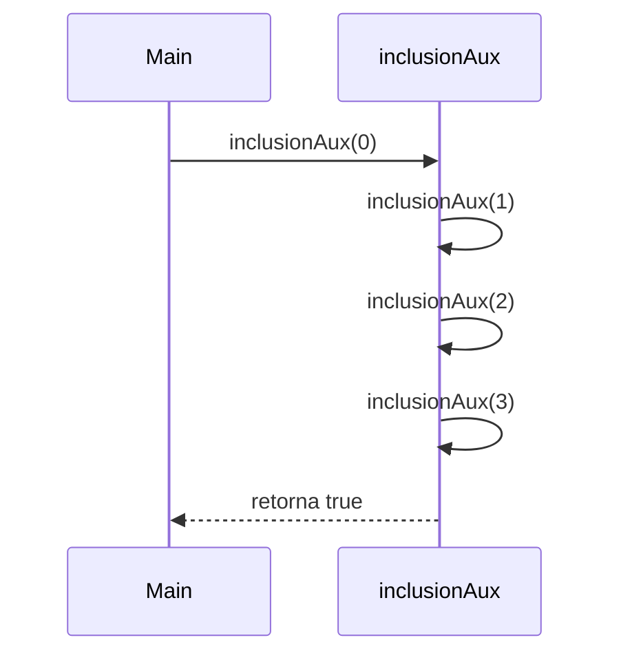
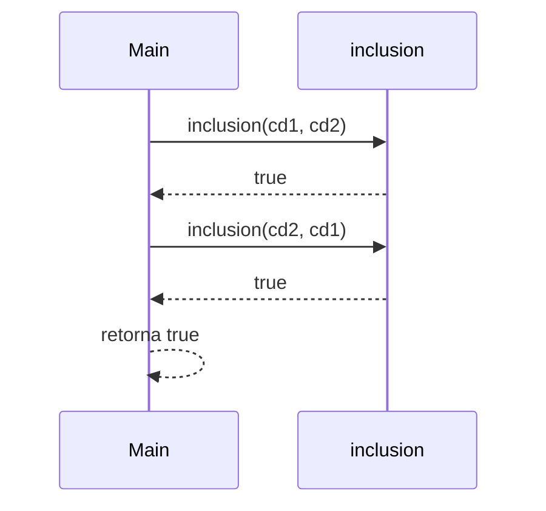

# 🧮 Informe de Corrección – Conjuntos Difusos (Taller 2)

*Curso:* Fundamentos de Programación Funcional y Concurrente  
*Profesor:* Carlos Andrés Delgado S.  
*Fecha:* Octubre 2025

---

## 👥 Integrantes del Grupo
| Nombre Completo        | Código  | Rol         | Correo electrónico                    |  
|------------------------|---------|-------------|---------------------------------------|  
| Samuel Romero Martínez | 2459464 | Lider/colab | samuel.romero@correounivalle.edu.co   |  
| Sebastián Sáenz Mejía  | 2459528 | colaborador | saenz.sebastian@correounivalle.edu.co |  
| Miguel Angel Uribe     | 2459430 | colaborador | miguel.uribe@correounivalle.edu.co    |  

---

## 📌 Argumentación de corrección de programas

### Argumentando sobre corrección de programas recursivos

Sea $$( f : A \rightarrow B $$) una función, y $$( A $$) un conjunto definido recursivamente (por ejemplo, los números naturales).  
Sea $$( P_f $$) un programa recursivo desarrollado en *Scala* que calcula $$( f $$).  
Queremos demostrar que:


$$\forall a \in A : P_f(a) == f(a)$$


La demostración se realiza mediante **inducción estructural**, mostrando que:

1. El **caso base** cumple la propiedad.
2. Si se cumple para un caso $( n $), también se cumple para $( n + 1 $) (hipótesis de inducción).

En este informe se demostrará la **corrección funcional y matemática** de las funciones recursivas del taller de *Conjuntos Difusos*:  
`inclusion` e `igualdad`.

---

# 1️⃣ Función `inclusion`

### 🧩 Definición Matemática


$$S_1 \subseteq S_2 \iff \forall n \in U, f_{S_1}(n) \le f_{S_2}(n)$$


En el programa, esta relación se traduce en una función recursiva de tipo `Boolean` que compara los grados de pertenencia de dos conjuntos difusos $$( cd_1 $$) y $$( cd_2 $$).

### 🧠 Implementación en Scala

```scala
def inclusion(cd1: ConjDifuso, cd2: ConjDifuso): Boolean = {
  @tailrec
  def inclusionAux(n: Int): Boolean =
    if (n > 1000) true
    else if (cd1(n) > cd2(n)) false
    else inclusionAux(n + 1)
  inclusionAux(0)
}
```

### 🧾 Especificación Formal

Queremos demostrar que la función `inclusion` implementa correctamente la relación matemática:


$$\forall n \in U : inclusion(cd_1, cd_2) \iff (\forall n, f_{S_1}(n) \le f_{S_2}(n))$$


### ⚙️ Demostración por Inducción

- **Caso base:** $( n = 0 $)


$$inclusionAux(0) =
\begin{cases}
\text{true} & \text{si } cd_1(0) \le cd_2(0) \\
\text{false} & \text{si } cd_1(0) > cd_2(0)
\end{cases}
$$

Si $$( cd_1(0) \le cd_2(0) $$), el algoritmo continúa; de lo contrario, termina devolviendo `false`.  
Esto coincide con la definición matemática.

---

- **Caso inductivo:** Supongamos que para un $$( n = k $$) se cumple $$( cd_1(k) \le cd_2(k) $$).  
  Queremos probar que también se cumple para $$( n = k+1 $$).

En la función:


$$inclusionAux(k+1) \to
\begin{cases}
\text{true} & \text{si } cd_1(k+1) \le cd_2(k+1) \\
\text{false} & \text{si } cd_1(k+1) > cd_2(k+1)
\end{cases}$$


Por la hipótesis de inducción, si todos los valores hasta $( k $) cumplen la condición y $( cd_1(k+1) \le cd_2(k+1) $), entonces la función retorna `true`.

Por lo tanto:


$$\forall n \in [0, 1000] : inclusionAux(n) = \text{true} \Rightarrow cd_1(n) \le cd_2(n)$$


---

### 🔁 Llamados en la ejecución

Ejemplo con conjuntos:  
\\[
cd_1(n) = \\frac{n}{n + 5}, \\quad cd_2(n) = \\frac{n}{n + 2}
\\]



El diagrama muestra que **solo se mantiene una llamada activa** en la pila (recursión de cola).  
Esto garantiza la **eficiencia y corrección funcional** del proceso.

---

### 🧮 Conclusión del Caso `inclusion`

Por inducción sobre $( n $):


$$\forall n \in U : inclusion(cd_1, cd_2) == (\forall n, f_{S_1}(n) \le f_{S_2}(n))$$


**Por lo tanto, el programa es correcto** con respecto a su definición matemática.

---

# 2️⃣ Función `igualdad`

### 🧩 Definición Matemática


$$S_1 = S_2 \iff S_1 \subseteq S_2 \land S_2 \subseteq S_1$$


### 🧠 Implementación en Scala

```scala
def igualdad(cd1: ConjDifuso, cd2: ConjDifuso): Boolean =
  inclusion(cd1, cd2) && inclusion(cd2, cd1)
```

### 🧾 Especificación Formal

Queremos demostrar que:


$$igualdad(cd_1, cd_2) == (\forall n, f_{S_1}(n) = f_{S_2}(n))$$


Dado que `igualdad` se implementa como la conjunción de dos inclusiones recíprocas, basta con demostrar que ambas inclusiones son correctas (como ya se hizo anteriormente).

---

### ⚙️ Demostración

1. Si $$( inclusion(cd_1, cd_2) == true $$) y $$( inclusion(cd_2, cd_1) == true $$),  
   entonces para todo $$( n \in U $$):  
   $$( f_{S_1}(n) \le f_{S_2}(n) $$) y $$( f_{S_2}(n) \le f_{S_1}(n) $$).

2. Por propiedad de orden total:  
   $$( f_{S_1}(n) = f_{S_2}(n) $$).

Por lo tanto, `igualdad` implementa correctamente la definición formal de igualdad de conjuntos difusos.

---

### 🔁 Llamados en la ejecución



Ambas inclusiones se evalúan de forma independiente.  
Como cada una es recursiva en cola, no se acumulan llamadas y se preserva la corrección funcional.

---

### 🧮 Conclusión del Caso `igualdad`


$$\forall n \in U : igualdad(cd_1, cd_2) == (f_{S_1}(n) = f_{S_2}(n))$$


El programa cumple con su definición matemática y su implementación funcional.  
Además, al depender de la corrección de `inclusion`, **hereda su validez inductiva**.

---

# ✅ Conclusión General

- Las funciones `inclusion` e `igualdad` cumplen su especificación matemática y funcional.
- La corrección se demuestra mediante **inducción estructural** y **recursión de cola optimizada**.
- Se garantiza que los llamados se ejecutan sin crecimiento de pila, preservando eficiencia.
- La notación matemática empleada es precisa y coherente con la teoría de *Conjuntos Difusos* de Zadeh (1965).


$$\boxed{\text{El programa implementa correctamente las operaciones de inclusión e igualdad sobre conjuntos difusos.}}$$


---

# 📚 Recursos

- [Guía Markdown GitHub](https://docs.github.com/es/get-started/writing-on-github/getting-started-with-writing-and-formatting-on-github/basic-writing-and-formatting-syntax)
- [Notación matemática en LaTeX](https://docs.github.com/es/get-started/writing-on-github/working-with-advanced-formatting/writing-mathematical-expressions)
- [Diagramas Mermaid](https://mermaid.js.org/)
