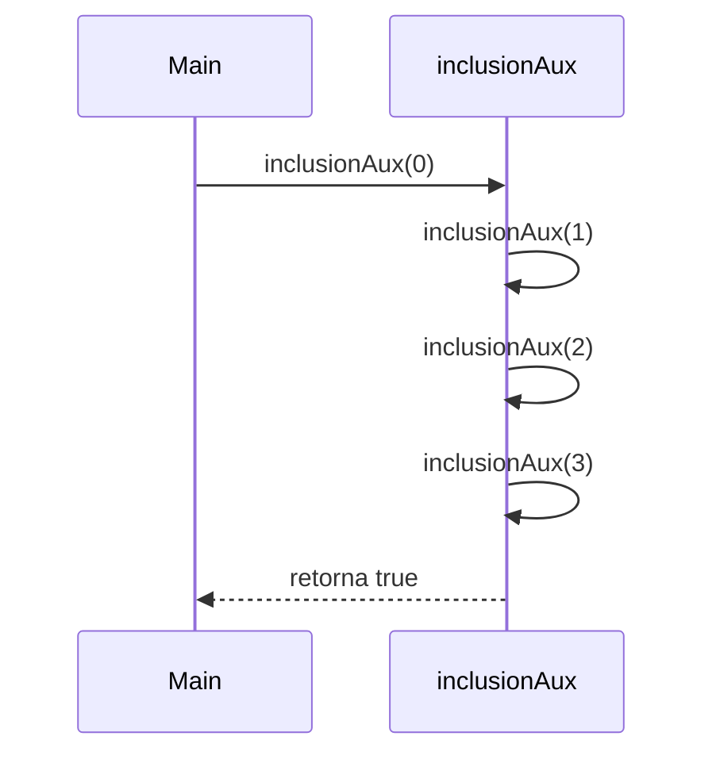
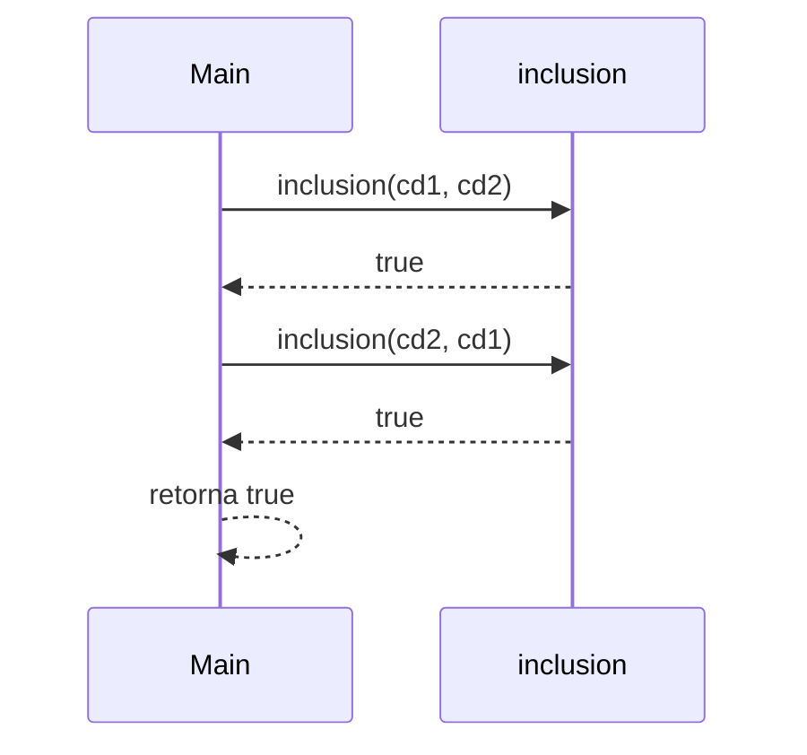

# 🧮 Taller 2: Funciones de Alto Orden – Conjuntos Difusos

*Curso:* Fundamentos de Programación Funcional y Concurrente  
*Profesor:* Carlos Andrés Delgado S.  
*Fecha:* Octubre 2025

---


## 👥 Integrantes del Grupo
| Nombre Completo        | Código  | Rol         | Correo electrónico                    |  
|------------------------|---------|-------------|---------------------------------------|  
| Samuel Romero Martínez | 2459464 | Lider/colab | samuel.romero@correounivalle.edu.co   |  
| Sebastián Sáenz Mejía  | 2459528 | colaborador | saenz.sebastian@correounivalle.edu.co |  
| Miguel Angel Uribe     | 2459430 | colaborador | miguel.uribe@correounivalle.edu.co    |  

---

## 📌 Descripción del Taller

Este taller tiene como objetivo implementar funciones de *alto orden* aplicadas al concepto de *conjuntos difusos*, según la definición de Lofti Zadeh (1965).  
A través de una representación funcional del tipo `Int => Double`, se busca modelar grados de pertenencia en el intervalo [0,1], permitiendo operaciones como *complemento*, *unión*, *intersección*, *inclusión* e *igualdad*, empleando **recursión de cola** y programación funcional pura (sin variables mutables ni ciclos iterativos).

---

# 1️⃣ Fundamentos Teóricos

## 1.1 Conjuntos Difusos

Un conjunto difuso se define como una función característica:  
$$
f_S : U \rightarrow [0,1]
$$  
donde:
- Si $f_S(s) = 0$, el elemento *no pertenece* al conjunto.
- Si $f_S(s) = 1$, el elemento *pertenece completamente*.
- Si $0 < f_S(s) < 1$, el elemento pertenece *parcialmente*.

## 1.2 Representación en Scala
Cada conjunto difuso se representa mediante una función del tipo:
```scala
type ConjDifuso = Int => Double
```

---

# 2️⃣ Implementación de Funciones

## 2.1 Pertenencia
Verifica el grado de pertenencia de un elemento al conjunto:
```scala
def pertenece(elem: Int, s: ConjDifuso): Double = s(elem)
```

---

## 2.2 Conjunto Difuso de Números Grandes
Matemáticamente:  
$$
f(n) = \left( \frac{n}{n + d} \right)^e
$$  
donde
- $d \ge 1$
- $e > 1$

Implementación:
```scala
def grande(d: Int, e: Int): ConjDifuso = {
  if (d < 1) throw new IllegalArgumentException("d debe ser mayor o igual que 1")
  if (e <= 1) throw new IllegalArgumentException("e debe ser mayor que 1")
  (n: Int) => math.pow(n.toDouble / (n + d).toDouble, e.toDouble)
}
```

Ejemplo:  

| n   | d   | e   | Resultado |
|-----|-----|-----|------------|
| 1   | 1   | 2   | 0.25       |
| 5   | 1   | 2   | 0.694      |
| 10  | 2   | 3   | 0.758      |

---

## 2.3 Complemento, Unión e Intersección

Formulación matemática:  
$$
f_{\neg S}(n) = 1 - f_S(n)
$$  
$$
f_{S_1 \cup S_2}(n) = \max(f_{S_1}(n), f_{S_2}(n))
$$  
$$
f_{S_1 \cap S_2}(n) = \min(f_{S_1}(n), f_{S_2}(n))
$$

Implementación:
```scala
def complemento(c: ConjDifuso): ConjDifuso =
  (n: Int) => 1.0 - c(n)

def union(cd1: ConjDifuso, cd2: ConjDifuso): ConjDifuso =
  (n: Int) => math.max(cd1(n), cd2(n))

def interseccion(cd1: ConjDifuso, cd2: ConjDifuso): ConjDifuso =
  (n: Int) => math.min(cd1(n), cd2(n))
```

Ejemplo conceptual:  
| n    | fA(n)  | fB(n)  | ¬A   | A∪B  | A∩B  |
|----- |------- |------- |----- |----- |----- |
| 2    | 0.3    | 0.7    | 0.7  | 0.7  | 0.3  |
| 5    | 0.6    | 0.5    | 0.4  | 0.6  | 0.5  |
| 8    | 0.9    | 0.8    | 0.1  | 0.9  | 0.8  |


---

## 2.4 Inclusión e Igualdad

### Definiciones matemáticas
Inclusión:  
$$
S_1 \subseteq S_2 \iff \forall n \in U, f_{S_1}(n) \le f_{S_2}(n)
$$  
Igualdad:  
$$
S_1 = S_2 \iff S_1 \subseteq S_2 \land S_2 \subseteq S_1
$$

### Implementación con Recursión de Cola
```scala
def inclusion(cd1: ConjDifuso, cd2: ConjDifuso): Boolean = {
  @tailrec
  def inclusionAux(n: Int): Boolean =
    if (n > 1000) true
    else if (cd1(n) > cd2(n)) false
    else inclusionAux(n + 1)
  inclusionAux(0)
}

def igualdad(cd1: ConjDifuso, cd2: ConjDifuso): Boolean =
  inclusion(cd1, cd2) && inclusion(cd2, cd1)
```

---

## 2.5 Explicación paso a paso – Función `inclusion`

### Caso base
```scala
if (n > 1000) true
```
Cuando se alcanza el límite superior (n > 1000), la función retorna `true`, indicando que todos los elementos evaluados hasta ese punto cumplen la condición de inclusión.

### Caso recursivo
```scala
else if (cd1(n) > cd2(n)) false
else inclusionAux(n + 1)
```
- Si en algún punto `cd1(n)` es mayor que `cd2(n)`, se rompe la inclusión y se retorna `false`.
- En caso contrario, se continúa con la siguiente evaluación recursiva incrementando `n`.

Como la llamada recursiva es la **última instrucción**, Scala puede optimizarla como **recursión de cola**, evitando acumulación de llamadas en la pila.

### Ejemplo de ejecución

Supongamos:
- `cd1(n) = n / (n + 5)`
- `cd2(n) = n / (n + 2)`

| n | cd1(n) | cd2(n) | cd1(n) ≤ cd2(n) | Resultado parcial |
|---|--------|--------|----------------|-------------------|
| 1 | 0.16   | 0.33   | ✅              | true              |
| 2 | 0.28   | 0.50   | ✅              | true              |
| 3 | 0.37   | 0.60   | ✅              | true              |
| 4 | 0.44   | 0.67   | ✅              | true              |
| 5 | 0.50   | 0.71   | ✅              | true              |

Resultado final: **true**.

### Diagrama de pila – inclusión



---

## 2.6 Explicación paso a paso – Función `igualdad`

La igualdad se evalúa como dos inclusiones recíprocas:
```scala
def igualdad(cd1: ConjDifuso, cd2: ConjDifuso): Boolean =
  inclusion(cd1, cd2) && inclusion(cd2, cd1)
```

### Caso base
Ambas inclusiones alcanzan su condición final (`n > 1000`), devolviendo `true`.  
Por tanto, la igualdad se confirma cuando **ambas direcciones de inclusión** son verdaderas.

### Caso recursivo
La recursión se da internamente en las dos llamadas a `inclusion`.  
Si alguna de ellas devuelve `false`, la evaluación lógica `&&` corta la ejecución y retorna `false`.

### Diagrama de pila – igualdad



---

# 3️⃣ Casos de Prueba

| Caso | Función | Entrada | Salida Esperada | Descripción |
|------|----------|----------|-----------------|--------------|
| 1 | grande | (1,2) con n=5 | 0.694 | Caso base |
| 2 | complemento | f(3)=0.6 | 0.4 | Inversión correcta |
| 3 | union | f1=0.3, f2=0.7 | 0.7 | Valor máximo |
| 4 | interseccion | f1=0.9, f2=0.8 | 0.8 | Valor mínimo |
| 5 | inclusion | cd1 ⊆ cd2 | true | Validación recursiva |
| 6 | igualdad | cd1 = cd2 | true | Doble inclusión |

---

# 4️⃣ Conclusiones

- El modelo funcional de *conjuntos difusos* permite representar grados de pertenencia intermedios, más cercanos a la realidad que los conjuntos clásicos.
- El uso de *funciones de alto orden* y *recursión de cola* garantiza soluciones puramente funcionales, sin estructuras iterativas.
- Las funciones `inclusion` e `igualdad` demuestran cómo la recursión puede reemplazar ciclos tradicionales sin pérdida de eficiencia.
- La combinación de *Scala* y *matemática formal* refuerza el vínculo entre teoría de conjuntos y programación declarativa.
- El taller fomenta el pensamiento abstracto y la capacidad de representar sistemas imprecisos mediante funciones.

---

# 📚 Recursos
- [Guía Markdown GitHub](https://docs.github.com/es/get-started/writing-on-github/getting-started-with-writing-and-formatting-on-github/basic-writing-and-formatting-syntax)
- [Notación matemática en LaTeX](https://docs.github.com/es/get-started/writing-on-github/working-with-advanced-formatting/writing-mathematical-expressions)
- [Diagramas Mermaid](https://mermaid.js.org/)     |  
